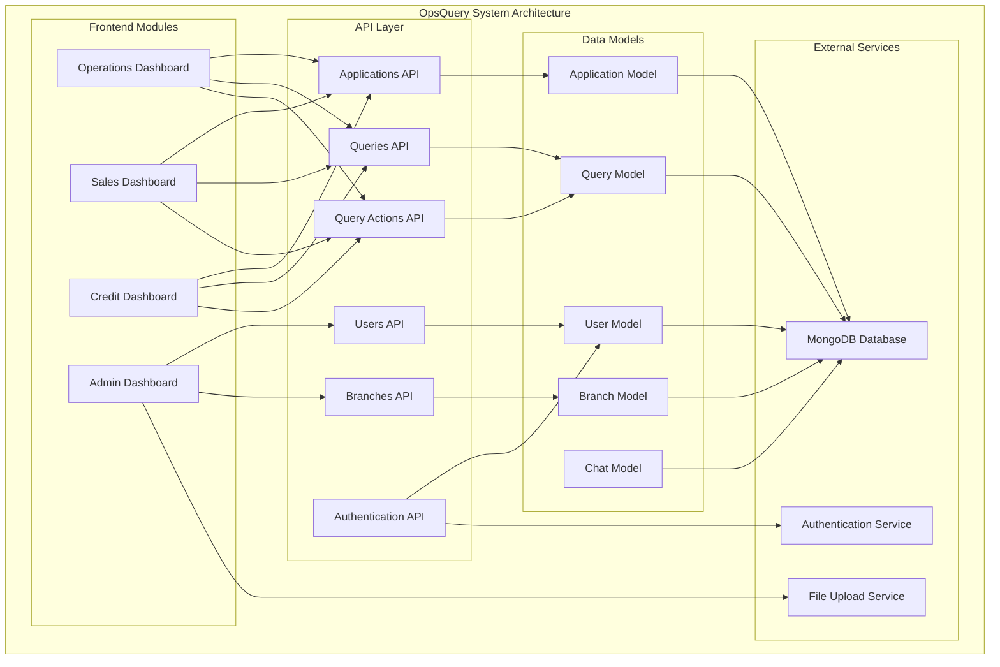
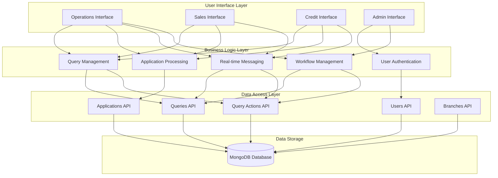
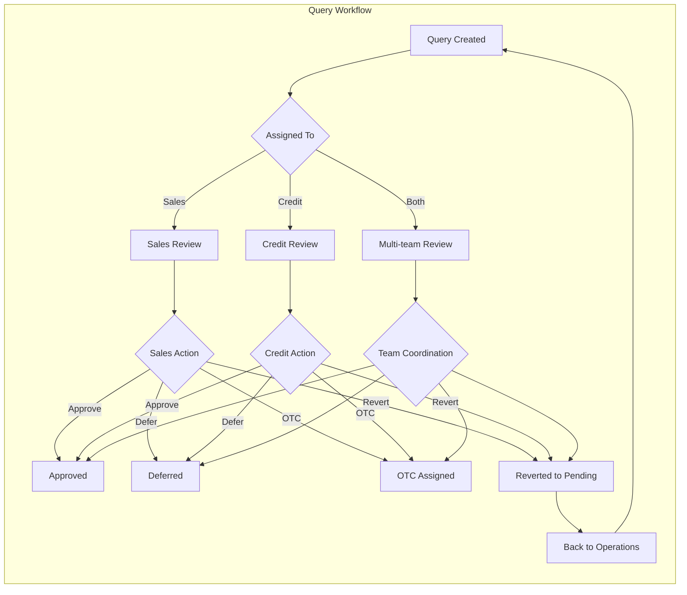
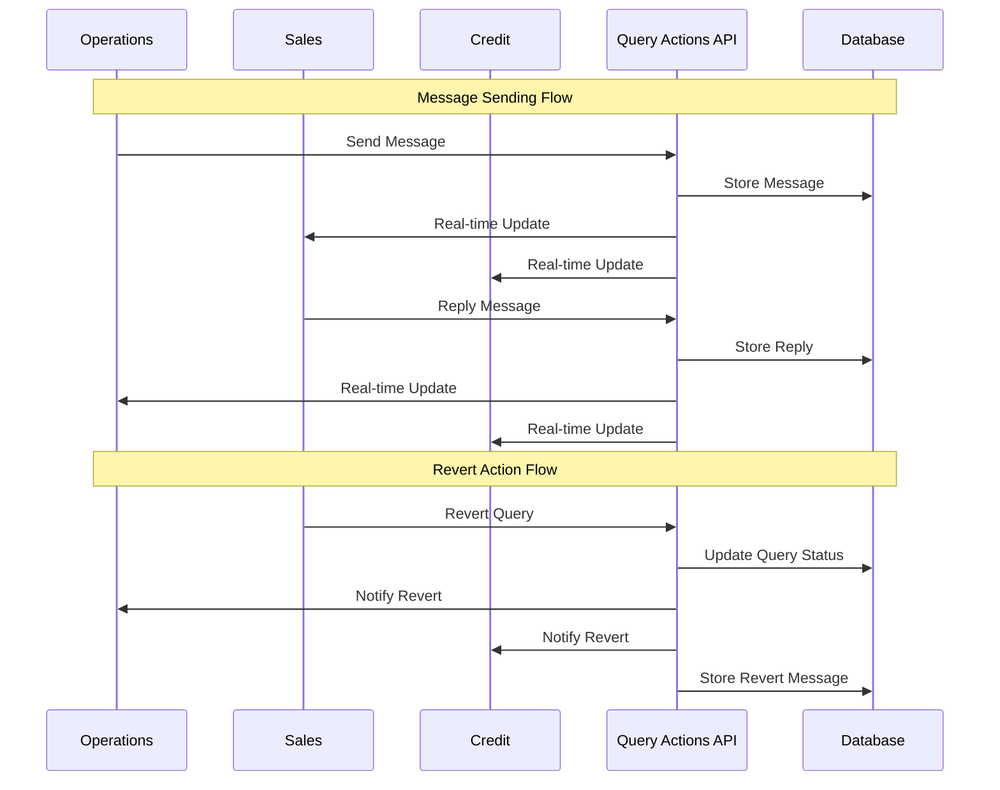

# OpsQuery - Real-time Query Management System


OpsQuery is a comprehensive real-time query management system designed for financial institutions to streamline communication and workflow between Operations, Sales, and Credit teams. The system provides role-based dashboards, real-time messaging, query tracking, and advanced workflow management.

## 🚀 Features

### Core Features
- **🔐 Role-Based Authentication**: Secure login with team-specific access control
- **📊 Real-time Dashboards**: Live updates across Operations, Sales, and Credit interfaces
- **💬 Real-time Messaging**: Instant communication between teams with message history
- **🔄 Query Workflow Management**: Complete lifecycle from query creation to resolution
- **📋 Application Tracking**: Comprehensive loan application management
- **⚡ Auto-refresh**: Real-time data synchronization across all dashboards
- **📱 Responsive Design**: Optimized for desktop, tablet, and mobile devices

### Team-Specific Features

#### Operations Team
- Query creation and management
- Application search and sanctioning workflow
- Real-time chat with Sales and Credit teams
- Query action management (Approve/Defer/OTC/Revert)
- Comprehensive query history and tracking

#### Sales Team
- Application-centric query view
- Real-time messaging with Operations and Credit
- Query status tracking and updates
- Team-specific dashboard with blue theme
- Query revert functionality

#### Credit Team
- Credit assessment dashboard
- Query review and resolution interface
- Real-time communication hub
- Team-specific dashboard with green theme
- Case management workflow

#### Admin Team
- User management and role assignment
- Branch management and configuration
- Bulk upload functionality
- System administration tools

## 📁 Project Structure

```
opsquery/
├── 📁 src/
│   ├── 📁 app/                           # Next.js 15 App Router
│   │   ├── 📁 admin-dashboard/           # Admin Interface Module
│   │   │   └── page.tsx                  # Admin Dashboard Page
│   │   │
│   │   ├── 📁 api/                       # Backend API Routes
│   │   │   ├── 📁 access-rights/         # User Access Control API
│   │   │   │   └── route.ts
│   │   │   ├── 📁 applications/          # Application Management API
│   │   │   │   ├── 📁 [appNo]/           # Dynamic App Number Routes
│   │   │   │   │   ├── 📁 queries/       # App-specific Query API
│   │   │   │   │   │   └── route.ts
│   │   │   │   │   └── route.ts          # Single App API
│   │   │   │   ├── 📁 debug/             # Debug API Endpoints
│   │   │   │   │   └── route.ts
│   │   │   │   ├── 📁 seed/              # Sample Data Seeding
│   │   │   │   │   └── route.ts
│   │   │   │   ├── 📁 stats/             # Application Statistics
│   │   │   │   │   └── route.ts
│   │   │   │   └── route.ts              # Main Applications API
│   │   │   ├── 📁 auth/                  # Authentication API
│   │   │   │   └── 📁 login/
│   │   │   │       └── route.ts
│   │   │   ├── 📁 branches/              # Branch Management API
│   │   │   │   ├── 📁 [id]/              # Dynamic Branch Routes
│   │   │   │   │   └── route.ts
│   │   │   │   ├── 📁 bulk-create/       # Bulk Branch Creation
│   │   │   │   │   └── route.ts
│   │   │   │   ├── 📁 bulk-update/       # Bulk Branch Updates
│   │   │   │   │   └── route.ts
│   │   │   │   ├── 📁 seed-production/   # Production Data Seeding
│   │   │   │   │   └── route.ts
│   │   │   │   └── route.ts              # Main Branches API
│   │   │   ├── 📁 bulk-upload/           # File Upload API
│   │   │   │   └── route.ts
│   │   │   ├── 📁 health/                # Health Check API
│   │   │   │   └── route.ts
│   │   │   ├── 📁 queries/               # Query Management API
│   │   │   │   ├── 📁 [queryId]/         # Dynamic Query Routes
│   │   │   │   │   ├── 📁 chat/          # Query Chat API
│   │   │   │   │   │   └── route.ts
│   │   │   │   │   └── route.ts          # Single Query API
│   │   │   │   └── route.ts              # Main Queries API
│   │   │   ├── 📁 query-actions/         # Query Actions & Workflow API
│   │   │   │   └── route.ts
│   │   │   ├── 📁 query-responses/       # Query Response Management
│   │   │   │   └── route.ts
│   │   │   └── 📁 users/                 # User Management API
│   │   │       ├── 📁 [id]/              # Dynamic User Routes
│   │   │       │   └── route.ts
│   │   │       ├── 📁 check-role/        # Role Verification API
│   │   │       │   └── route.ts
│   │   │       └── route.ts              # Main Users API
│   │   │
│   │   ├── 📁 control-panel/             # Control Panel Module
│   │   │   └── page.tsx
│   │   ├── 📁 credit-dashboard/          # Credit Team Interface
│   │   │   └── page.tsx
│   │   ├── 📁 login/                     # Authentication Module
│   │   │   └── page.tsx
│   │   ├── 📁 operations/                # Operations Team Interface
│   │   │   ├── operations.css            # Operations-specific styles
│   │   │   └── page.tsx
│   │   ├── 📁 query-details/             # Query Details Module
│   │   │   └── 📁 [appNo]/
│   │   │       └── page.tsx
│   │   ├── 📁 query-reply/               # Query Reply Interface
│   │   │   └── 📁 [appNo]/
│   │   ├── 📁 query-resolve/             # Query Resolution Module
│   │   │   └── 📁 [appNo]/
│   │   │       └── page.tsx
│   │   ├── 📁 sales/                     # Sales Team Interface
│   │   │   └── page.tsx
│   │   ├── 📁 sales-dashboard/           # Sales Dashboard Module
│   │   │   └── page.tsx
│   │   ├── favicon.ico                   # App Favicon
│   │   ├── globals.css                   # Global Styles
│   │   ├── layout.tsx                    # Root Layout
│   │   └── page.tsx                      # Homepage
│   │
│   ├── 📁 components/                    # React Components Library
│   │   ├── 📁 admin/                     # Admin Components
│   │   │   ├── AdminDashboard.tsx        # Main Admin Dashboard
│   │   │   ├── AdminNavbar.tsx           # Admin Navigation
│   │   │   ├── BranchManagementTab.tsx   # Branch Management Interface
│   │   │   ├── BulkUploadTab.tsx         # Bulk Upload Interface
│   │   │   └── UserCreationTab.tsx       # User Management Interface
│   │   │
│   │   ├── 📁 auth/                      # Authentication Components
│   │   │   ├── ControlPanelLogin.tsx     # Control Panel Login
│   │   │   ├── Login.tsx                 # Main Login Component
│   │   │   └── ProtectedRoute.tsx        # Route Protection
│   │   │
│   │   ├── 📁 credit/                    # Credit Team Components
│   │   │   ├── CaseAccordion.tsx         # Collapsible Case View
│   │   │   ├── CreditDashboard.tsx       # Main Credit Dashboard
│   │   │   ├── CreditHeader.tsx          # Credit Dashboard Header
│   │   │   ├── CreditNavbar.tsx          # Credit Navigation
│   │   │   ├── CreditQueryProvider.tsx   # Credit Query Data Provider
│   │   │   ├── CreditQueryResolved.tsx   # Resolved Queries View
│   │   │   └── QueryItem.tsx             # Individual Query Item
│   │   │
│   │   ├── 📁 operations/                # Operations Team Components
│   │   │   ├── AddQuery.tsx              # Query Creation Form
│   │   │   ├── CaseAccordion.tsx         # Case Management View
│   │   │   ├── EmptyState.tsx            # Empty State Component
│   │   │   ├── ErrorState.tsx            # Error State Component
│   │   │   ├── LoadingState.tsx          # Loading State Component
│   │   │   ├── OperationsDashboard.tsx   # Main Operations Dashboard
│   │   │   ├── OperationsHeader.tsx      # Operations Header
│   │   │   ├── OperationsNavbar.tsx      # Operations Navigation
│   │   │   ├── OperationsQueryProvider.tsx # Operations Query Provider
│   │   │   ├── QueryItem.tsx             # Query Item Component
│   │   │   ├── QueryRaised.tsx           # Raised Queries View
│   │   │   ├── QueryResolved.tsx         # Resolved Queries View
│   │   │   ├── SanctionedCases.tsx       # Sanctioned Cases View
│   │   │   ├── TabNavigation.tsx         # Tab Navigation Component
│   │   │   └── utils.ts                  # Utility Functions
│   │   │
│   │   ├── 📁 sales/                     # Sales Team Components
│   │   │   ├── CaseAccordion.tsx         # Sales Case View
│   │   │   ├── QueryItem.tsx             # Sales Query Item
│   │   │   ├── SalesDashboard.tsx        # Main Sales Dashboard
│   │   │   ├── SalesHeader.tsx           # Sales Dashboard Header
│   │   │   ├── SalesNavbar.tsx           # Sales Navigation
│   │   │   ├── SalesQueryProvider.tsx    # Sales Query Data Provider
│   │   │   └── SalesQueryResolved.tsx    # Sales Resolved Queries
│   │   │
│   │   └── 📁 shared/                    # Shared/Common Components
│   │       ├── QueryChatModal.tsx        # Chat Modal Component
│   │       ├── QueryHistoryModal.tsx     # Query History Modal
│   │       ├── QueryReplyModal.tsx       # Reply Modal Component
│   │       ├── ResolvedQueriesTable.tsx  # Resolved Queries Table
│   │       ├── RevertMessageBox.tsx      # Revert Message Display
│   │       ├── shared.css                # Shared Styles
│   │       └── StatusUtils.tsx           # Status Utility Components
│   │
│   ├── 📁 contexts/                      # React Context Providers
│   │   ├── AuthContext.tsx               # Authentication Context
│   │   ├── BranchContext.tsx             # Branch Data Context
│   │   └── QueryClientProvider.tsx       # TanStack Query Provider
│   │
│   ├── 📁 lib/                          # Utility Libraries
│   │   ├── 📁 models/                    # Data Models
│   │   │   ├── Application.ts            # Application Data Model
│   │   │   ├── Branch.ts                 # Branch Data Model
│   │   │   ├── Chat.ts                   # Chat Message Model
│   │   │   └── User.ts                   # User Data Model
│   │   └── mongodb.ts                    # MongoDB Connection
│   │
│   └── 📁 types/                        # TypeScript Definitions
│       └── shared.ts                     # Shared Type Definitions
│
├── 📁 public/                           # Static Assets
│   ├── icon.png                         # App Icon
│   ├── logo.png                         # App Logo
│   ├── manifest.json                    # PWA Manifest
│   ├── next.svg                         # Next.js Logo
│   ├── sample-applications.csv          # Sample Data
│   ├── vercel.svg                       # Vercel Logo
│   └── window.svg                       # Window Icon
│
├── eslint.config.mjs                    # ESLint Configuration
├── next.config.ts                       # Next.js Configuration
├── package-lock.json                    # Package Lock File
├── package.json                         # Package Dependencies
├── postcss.config.mjs                   # PostCSS Configuration
├── README.md                            # Project Documentation
└── tsconfig.json                        # TypeScript Configuration
```

## 🏗️ System Architecture

### Module Overview



### Data Flow Architecture



## 🔧 Component Architecture

### Component Hierarchy

```
App (Root Layout)
├── Auth Components
│   ├── Login
│   ├── ProtectedRoute
│   └── ControlPanelLogin
│
├── Dashboard Modules
│   ├── Operations Dashboard
│   │   ├── OperationsHeader
│   │   ├── OperationsNavbar
│   │   ├── QueryRaised
│   │   ├── QueryResolved
│   │   ├── SanctionedCases
│   │   ├── AddQuery
│   │   └── TabNavigation
│   │
│   ├── Sales Dashboard
│   │   ├── SalesHeader
│   │   ├── SalesNavbar
│   │   ├── SalesDashboard
│   │   ├── SalesQueryResolved
│   │   ├── QueryItem
│   │   └── CaseAccordion
│   │
│   ├── Credit Dashboard
│   │   ├── CreditHeader
│   │   ├── CreditNavbar
│   │   ├── CreditDashboard
│   │   ├── CreditQueryResolved
│   │   ├── QueryItem
│   │   └── CaseAccordion
│   │
│   └── Admin Dashboard
│       ├── AdminNavbar
│       ├── AdminDashboard
│       ├── UserCreationTab
│       ├── BranchManagementTab
│       └── BulkUploadTab
│
├── Shared Components
│   ├── QueryChatModal
│   ├── QueryHistoryModal
│   ├── QueryReplyModal
│   ├── RevertMessageBox
│   ├── ResolvedQueriesTable
│   └── StatusUtils
│
├── State Management
│   ├── LoadingState
│   ├── ErrorState
│   └── EmptyState
│
└── Context Providers
    ├── AuthContext
    ├── BranchContext
    └── QueryClientProvider
```

## 🔄 Workflow Process

### Query Lifecycle



### Real-time Communication Flow



## 🛠️ Technology Stack

### Frontend
- **Next.js 15.3.5**: React framework with App Router
- **React 18**: UI library with hooks and context
- **TypeScript 5.0**: Type-safe JavaScript development
- **TailwindCSS 3.0**: Utility-first CSS framework
- **TanStack Query**: Data fetching and caching
- **React Icons**: Icon library

### Backend
- **Next.js API Routes**: Server-side API endpoints
- **MongoDB**: NoSQL database for data storage
- **RESTful APIs**: Standard HTTP methods for data operations

### Development Tools
- **ESLint**: Code linting and formatting
- **PostCSS**: CSS processing
- **TypeScript Config**: Type checking configuration

## 🚀 Getting Started

### Prerequisites
- Node.js 18+ 
- npm or yarn
- MongoDB database (local or cloud)

### Installation

1. **Clone the repository**
```bash
git clone https://github.com/techbizloanindia/Ops_Queries.git
cd opsquery
```

2. **Install dependencies**
```bash
npm install
```

3. **Environment Setup**
Create a `.env.local` file:
```env
MONGODB_URI=your_mongodb_connection_string
MONGODB_DATABASE=querymodel
NEXT_PUBLIC_APP_URL=http://localhost:3000
NEXT_PUBLIC_BASE_URL=http://localhost:3000
```

4. **Run Development Server**
```bash
npm run dev
```

5. **Production Build**
```bash
npm run build
npm run start
```

## 📊 Dashboard Access

| Team | URL | Description |
|------|-----|-------------|
| **Operations** | `/operations` | Query creation, management, and workflow |
| **Sales** | `/sales` or `/sales-dashboard` | Sales-specific query interface |
| **Credit** | `/credit-dashboard` | Credit assessment and review interface |
| **Admin** | `/admin-dashboard` | User and system administration |
| **Control Panel** | `/control-panel` | System control and monitoring |

## 📱 Features by Module

### Operations Module
- ✅ **Query Creation**: Raise new queries for applications
- ✅ **Real-time Chat**: Communicate with Sales and Credit teams
- ✅ **Workflow Management**: Approve/Defer/OTC/Revert actions
- ✅ **Application Search**: Find and track sanctioned cases
- ✅ **Query Tracking**: Monitor query status and history
- ✅ **Auto-refresh**: Real-time updates every 5 seconds

### Sales Module
- ✅ **Application View**: Application-centric query management
- ✅ **Real-time Messaging**: Send and receive messages instantly
- ✅ **Query Status Tracking**: Monitor query progress
- ✅ **Revert Functionality**: Revert queries back to Operations
- ✅ **Team Communication**: Coordinate with Operations and Credit
- ✅ **Blue Theme**: Team-specific visual identity

### Credit Module
- ✅ **Credit Assessment**: Review and assess credit queries
- ✅ **Real-time Communication**: Instant messaging capabilities
- ✅ **Case Management**: Organize and track credit cases
- ✅ **Query Resolution**: Resolve credit-related queries
- ✅ **Team Coordination**: Work with Operations and Sales
- ✅ **Green Theme**: Team-specific visual identity

### Admin Module
- ✅ **User Management**: Create and manage user accounts
- ✅ **Role Assignment**: Assign team roles and permissions
- ✅ **Branch Management**: Manage branch information
- ✅ **Bulk Operations**: Bulk upload and data management
- ✅ **System Configuration**: Configure system settings

## 🔐 Security Features

- **Role-based Access Control**: Team-specific access permissions
- **Protected Routes**: Authentication required for all dashboards
- **Secure API Endpoints**: Server-side validation and authorization
- **Session Management**: Secure user session handling
- **Data Validation**: Input validation on all forms

## 📈 Performance Features

- **Real-time Updates**: Live data synchronization
- **Optimistic Updates**: Immediate UI feedback
- **Caching**: TanStack Query for efficient data management
- **Lazy Loading**: Component-based code splitting
- **Responsive Design**: Mobile-first responsive layout

## 🔧 API Documentation

### Core Endpoints

| Endpoint | Method | Description |
|----------|--------|-------------|
| `/api/queries` | GET, POST, PATCH | Query management |
| `/api/query-actions` | GET, POST | Query actions and messaging |
| `/api/applications` | GET, POST | Application management |
| `/api/users` | GET, POST, PATCH, DELETE | User management |
| `/api/branches` | GET, POST, PATCH, DELETE | Branch management |
| `/api/auth/login` | POST | User authentication |

### Message Types
- `type: 'message'` - Regular chat messages
- `type: 'action'` - Query actions (approve/defer/otc)
- `type: 'revert'` - Query revert actions

## 🧪 Testing

The system includes comprehensive testing for:
- **Component Functionality**: All React components
- **API Endpoints**: Backend API validation
- **Real-time Features**: Message and update synchronization
- **Authentication**: Login and access control
- **Workflow**: End-to-end query lifecycle

## 🤝 Contributing

1. Fork the repository
2. Create a feature branch (`git checkout -b feature/amazing-feature`)
3. Commit your changes (`git commit -m 'Add amazing feature'`)
4. Push to the branch (`git push origin feature/amazing-feature`)
5. Open a Pull Request

## 📄 License

This project is licensed under the MIT License - see the [LICENSE](LICENSE) file for details.

### Copyright Notice
```
Copyright (c) 2024 OpsQuery - Real-time Query Management System
```

### MIT License Summary
- ✅ **Commercial use** allowed
- ✅ **Modification** allowed  
- ✅ **Distribution** allowed
- ✅ **Private use** allowed
- ❌ **Liability** - No warranty provided
- ❌ **Warranty** - Software provided "as is"

---

**OpsQuery v2.0** - Streamlining Financial Query Management with Real-time Communication